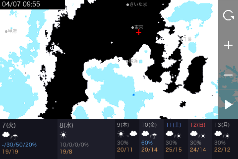

# Raspberry Pi 雨雲レーダー + 天気予報

そのへんに転がっていたRaspberry Pi 3 B+を使い、雨雲レーダーを MHS-3.5inch GPIO LCD (480x320) にインタラクティブ表示する。

ラズパイにはRaspberryPi OS Liteを入れる。

LCDは`STARTO 3.5インチ Raspberry Pi用ディスプレイ 保護ケース付属 タッチパネル 320*480解像度 TS11`というもの。Amazon販売ページが消えていて詳細わからない。ドライバーは下記セットアップの内容を参照。

## 概要

- **データソース**: 気象庁ナウキャスト雨雲レーダータイル + 天気予報API（無料・APIキー不要）
- **背景地図**: CartoDB Dark Matter（ダークモード、コントラスト強化、県庁所在地表示）
- **表示方法**: PIL で合成 → フレームバッファ (`/dev/fb1`) に直接書き込み
- **表示範囲**: `.env` で指定した初期位置中心（スワイプで移動、zoom 6〜11 で拡大縮小可能）
- **天気予報**: 画面下部に7日間天気予報（今日・明日は時間帯別降水確率付き）
- **タッチ操作**: スワイプでマップ移動、ボタンでズーム/アニメーション/リロード
- **レーダー**: 偶数ズーム (6,8,10) でタイル取得し全ズームで表示

### 画面レイアウト



```
+---------------------------------------------------------+
|  12/01 12:30  県庁所在地(・名前)                     [↻]   |
|               初期位置(赤+)                       [＋]    |
|         地図 + レーダー (480x240px)                  [−]  |
|         コントラスト強化済み                          [▶]  |
+---------------------------------------------------------+
| 1(月)        2(火)        | 3(水) 4(木) 5(金) 6(土) 7(日) |
| ☁           ☁/☂          | ☀    ☀→☁   ☁/☂   ☁/☀   ☁/☀   |
| -/-/0%/0%   20/50/50/20% | 10%  30%   60%   30%   30%   |
|             18/16        | 19/8 20/11 20/14 25/15 24/14 |
+---------------------------------------------------------+
```

### 操作方法

| 操作 | 動作 |
|------|------|
| スワイプ | マップをリアルタイムにパン（30fps追従、離すとタイル再取得） |
| ↻ ボタン | デフォルト位置・ズームに戻してデータ再取得 |
| ＋ ボタン | ズームイン（zoom 6〜11、上限で暗転） |
| − ボタン | ズームアウト（下限で暗転） |
| ▶ ボタン | 過去3h+予報1hのアニメーション再生（2ループで自動停止、再生中は■で手動停止） |

### 動作の流れ

1. 起動時: 最新のレーダー1フレーム + 7日間天気予報を表示
2. 5分ごとに最新データを自動再取得
3. ▶ タップでアニメーション開始（並列取得で高速化、約49フレーム×2ループ）
4. スワイプ中は30fpsでマップ追従（天気予報バー・ボタンは固定）
5. ズーム/パン時はタイルを並列再取得

開発用PC 上ではフレームバッファの代わりに `frames/` ディレクトリに PNG を出力する。

### 技術メモ

- **レーダータイル**: JMA `hrpns` は偶数ズーム (6,8,10) のみデータ配信。奇数ズーム時は直下の偶数ズームで取得しリサイズ合成
- **タッチ**: ADS7846 抵抗膜式（単点タッチ）。evdev で ADC 値を読み取り、キャリブレーション定数で画面座標に変換。XY スワップ・反転は実機依存
- **天気予報**: JMA `forecast/130000.json` から取得。data[0] に3日間詳細（時間帯別降水確率）、data[1] に7日間概要。気温は area code 44132 (東京)
- **バックライト**: MHS-3.5inch LCD のバックライトは VCC 直結でソフトウェア制御不可。GPIO 18、sysfs backlight、fb blank いずれも効かない。常時点灯で運用するか、物理スイッチの追加が必要

## セットアップ

### 1. (ラズパイのみ) MHS-3.5inch LCD ドライバのインストール

> Debian Trixie (Bookworm以降) では設定ファイルが `/boot/firmware/config.txt` にある点に注意。

```bash
sudo apt install git
git clone https://github.com/Lcdwiki/LCD-show.git
cd LCD-show
sudo ./MHS35-show
```

自動的に再起動されるが、Trixie ではこのスクリプトが `/boot/config.txt` に書き込むため正しく反映されない。
再起動後に `ls /dev/fb*` で `fb1` が表示されなければ、手動で `/boot/firmware/config.txt` を編集する:

```bash
sudo nano /boot/firmware/config.txt
```

以下を変更:
- `#dtparam=spi=on` → コメント解除して `dtparam=spi=on`
- `dtoverlay=vc4-kms-v3d` → コメントアウト `#dtoverlay=vc4-kms-v3d`
- `[all]` セクションに `dtoverlay=mhs35:rotate=90` を追加

```bash
sudo reboot
```

再起動後に `ls /dev/fb*` で `/dev/fb0` と `/dev/fb1` が表示されれば OK。

### 1b. (ラズパイのみ) タッチパネルの極性修正

LCD-show 同梱の `mhs35.dtbo` はタッチの `pendown-gpio` が `GPIO_ACTIVE_HIGH` になっているが、
実際のハードウェアはアクティブロー（押すと LOW）。このまま使うとタッチが反応しない。

```bash
# オーバーレイをデコンパイル
dtc -I dtb -O dts /boot/firmware/overlays/mhs35.dtbo > /tmp/mhs35.dts 2>/dev/null

# pendown-gpio の極性を ACTIVE_LOW (0x01) に修正
sed -i 's/pendown-gpio = <0xdeadbeef 0x11 0x00>/pendown-gpio = <0xdeadbeef 0x11 0x01>/' /tmp/mhs35.dts

# リコンパイルして上書き
dtc -I dts -O dtb -@ -o /tmp/mhs35.dtbo /tmp/mhs35.dts 2>/dev/null
sudo cp /tmp/mhs35.dtbo /boot/firmware/overlays/mhs35.dtbo
sudo reboot
```

再起動後の確認:

```bash
# 触らずに5秒待ち、割り込みが増えないことを確認
cat /proc/interrupts | grep ads
sleep 5 && cat /proc/interrupts | grep ads

# タッチテスト (画面を押して Event 行が出れば OK、Ctrl+C で終了)
sudo apt install evtest
sudo evtest /dev/input/event0
```

### 2. (ラズパイのみ RaspberryPi OS Lite はデフォでuv未導入) uv インストール

```bash
curl -LsSf https://astral.sh/uv/install.sh | sh
source ~/.bashrc
```

### 3. 仮想環境作成 & 依存パッケージインストール

```bash
# evdev のビルドに Python 開発ヘッダが必要
sudo apt install python3-dev

cd ~
uv venv
source .venv/bin/activate
uv pip install requests Pillow numpy evdev dotenv
```

### 4. (ラズパイのみ) 日本語フォント

```bash
sudo apt install fonts-ipaexfont-gothic
```

## 実行

### 開発用PC でプレビュー

```bash
uv run python weather.py
```

フレームバッファが見つからない場合、`frames/` ディレクトリに PNG が保存される。

### Raspberry Pi へのデプロイ

```bash
# SSH 接続
ssh pi@<ラズパイIP>

# ラズパイの~直下にファイル転送 (SSHなしでPC側から実行)
scp weather.py pi@<ラズパイIP>:~
scp .env pi@<ラズパイIP>:~
```

### Raspberry Pi で LCD 表示

```bash
# ラズパイ上で直接実行
sudo ~/.venv/bin/python ~/weather.py

# または 開発用PC からリモート実行
ssh pi@<ラズパイIP> "sudo /home/pi/.venv/bin/python ~/weather.py"

# 停止する場合
ssh pi@<ラズパイIP> "sudo pkill -f weather.py"
```

> `sudo` はフレームバッファ (`/dev/fb1`) への書き込みに必要。

### 自動起動 (systemd)

`sudo reboot`して30秒くらいで自動で``weather.py`が実行される。

```bash
sudo tee /etc/systemd/system/weather-radar.service << 'EOF'
[Unit]
Description=JMA Rain Radar Display
After=network-online.target
Wants=network-online.target

[Service]
ExecStart=/home/pi/.venv/bin/python /home/pi/weather.py
Restart=always
RestartSec=30
User=root
WorkingDirectory=/home/pi

[Install]
WantedBy=multi-user.target
EOF

sudo systemctl daemon-reload
sudo systemctl enable --now weather-radar
```

## `.env` の設定

`.env` ファイルをプロジェクトルートに作成すること。

```bash
# 初期位置の緯度経度
DEFAULT_LAT=35.65861075899261
DEFAULT_LON=139.7454087113323

# デフォルトズームレベル
DEFAULT_ZOOM=9
```

## 設定の変更

`weather.py` 先頭の定数を編集:

| 定数 | 説明 | デフォルト |
|------|------|-----------|
| `FRAMEBUFFER_DEVICE` | フレームバッファデバイス | `/dev/fb1` |
| `DEFAULT_ZOOM` | 初期ズームレベル (`.env`) | `9` |
| `DEFAULT_LAT`, `DEFAULT_LON` | 初期位置の緯度経度 (`.env`) | 東京タワー |
| `DEFAULT_TILE_X`, `DEFAULT_TILE_Y` | 初期タイル座標 (緯度経度から自動算出) | - |
| `ZOOM_MIN`, `ZOOM_MAX` | ズーム範囲 | `6`, `11` |
| `BASE_MAP_CONTRAST` | 背景地図コントラスト倍率 | `1.6` |
| `FRAME_INTERVAL` | アニメーションフレーム間隔 (秒) | `0.5` |
| `LAST_FRAME_PAUSE` | 最終フレーム停止時間 (秒) | `3.0` |
| `DATA_REFRESH_INTERVAL` | データ再取得間隔 (秒) | `300` (5分) |
| `TOUCH_SWAP_XY` | タッチ XY 軸スワップ | `True` |
| `TOUCH_INVERT_X` | タッチ X 軸反転 | `True` |
| `TOUCH_INVERT_Y` | タッチ Y 軸反転 | `False` |

## ファイル構成

| ファイル | 内容 |
|---------|------|
| `weather.py` | メインスクリプト（全ロジック） |
| `README.md` | このファイル |
| `/boot/firmware/config.txt` | ラズパイのブート設定（LCD ドライバ・SPI 有効化） |
